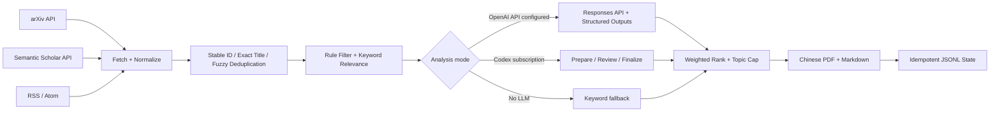

# cv-research-radar

`cv-research-radar` is a lightweight Python 3.12 project that collects, filters, analyzes, ranks, and summarizes new computer-vision papers and research posts. It produces private Chinese-language daily reports in both PDF and Markdown while preserving the original English titles.

The current version supports:

- arXiv API queries for `cs.CV`, `eess.IV`, additional categories, and configurable keywords;
- Semantic Scholar metadata enrichment by title, arXiv ID, or DOI;
- standard RSS and Atom feeds for research blogs and labs;
- stable-ID, normalized-title, and RapidFuzz title deduplication;
- rule-based filtering, weighted ranking, exploration coverage, and a 40% per-topic cap;
- optional OpenAI Responses API analysis with Structured Outputs;
- a no-API ChatGPT Pro/Codex subscription review workflow;
- Chinese Markdown and PDF reports with idempotent JSONL state.

The first version intentionally does not include web scraping, browser automation, full-paper PDF analysis, or embedding API calls.

## Architecture



Each source is isolated at its boundary. If one API, feed, or enrichment request fails, the pipeline logs the error and continues with the remaining sources, fallback analysis, report generation, and state persistence.

## Installation

```bash
git clone https://github.com/JunhaoLiXD/cv-research-radar.git
cd cv-research-radar
python -m venv .venv

# Windows PowerShell
.venv\Scripts\Activate.ps1

# macOS/Linux
source .venv/bin/activate

python -m pip install -e ".[dev]"
```

Secrets are read only from environment variables. `.env.example` documents the available names, but the application does not require a `.env` file.

```bash
# Optional: enables Responses API analysis.
export OPENAI_API_KEY="..."
export OPENAI_MODEL="a-structured-outputs-capable-model"

# Optional: higher Semantic Scholar rate limits.
export SEMANTIC_SCHOLAR_API_KEY="..."

# Optional: used when --date is omitted. This is the default.
export RADAR_TIMEZONE="America/New_York"
```

In PowerShell, use syntax such as `$env:SEMANTIC_SCHOLAR_API_KEY="..."`. Never place real values in `.env.example`, YAML files, source code, fixtures, logs, or reports.

## Command-line usage

```bash
python -m cv_radar validate-config
python -m cv_radar list-sources
python -m cv_radar run
python -m cv_radar run --date 2026-07-10
python -m cv_radar backfill --days 7
```

When `OPENAI_API_KEY` is absent, `run` remains fully operational. It uses deterministic keyword and metadata scoring and clearly marks the report as not LLM-analyzed. When a Semantic Scholar key is absent, anonymous enrichment is attempted; rate limits or failures leave the original arXiv record intact.

## No-API ChatGPT Pro/Codex workflow

Use this mode when you have a ChatGPT Pro/Codex subscription and do not want OpenAI API token charges. It uses a strict two-stage file exchange:

```bash
# 1. Fetch, normalize, deduplicate, filter, and export review candidates.
python -m cv_radar prepare-review --date 2026-07-10

# 2. Ask Codex to follow review/2026-07-10-prompt.md and write the strict
#    JSON result to review/2026-07-10-analysis.json.

# 3. Validate the analysis, rerank candidates, and generate Markdown/PDF.
python -m cv_radar finalize-review --date 2026-07-10
```

`prepare-review` creates:

- `review/YYYY-MM-DD-candidates.json`: normalized candidates, stable fingerprints, rule matches, and fallback analysis;
- `review/YYYY-MM-DD-prompt.md`: safety boundaries, analysis instructions, and the strict JSON Schema;
- an expected output path at `review/YYYY-MM-DD-analysis.json`.

Both `prepare-review` and `finalize-review` hard-disable the API analyzer even if `OPENAI_API_KEY` is present. `finalize-review` rejects missing, duplicate, unexpected, wrong-date, or schema-invalid analyses. Reimporting the same valid analysis is idempotent.

Each reviewed item contains a Chinese overview, concrete highlights, a novelty or noteworthy-aspect explanation, the core idea, why it matters, limitations, connections to configured research interests, code availability, and a recommended action: intensive reading, skim, watch, or skip.

For the simplest interactive workflow, open the repository in Codex and ask:

```text
Follow prompts/daily_codex_review.md and generate today's research report.
```

The durable task instructions are stored in `prompts/daily_codex_review.md`.

## Local Codex scheduled task

A local Codex Scheduled task can run the subscription workflow every day without an OpenAI API key. The current project is designed for a local task at 20:30 in `America/New_York`:

1. Keep the computer powered on and the ChatGPT/Codex desktop app running at the scheduled time.
2. Run the task against the local project, not an isolated worktree, so private reports are written to the main checkout.
3. Use `prompts/daily_codex_review.md` as the durable task instruction.
4. Restart the desktop app after adding or changing project rules.

When `--date` is omitted, the CLI reads `RADAR_TIMEZONE`, which defaults to `America/New_York`. This lets the scheduled task use fixed commands:

```bash
python -m cv_radar prepare-review
python -m cv_radar finalize-review
```

The project-level `.codex/rules/cv-radar.rules` grants unattended network access only to the `prepare-review` entry point. It does not allow other Python commands, `cv_radar run`, or Git commands outside the normal sandbox policy. The repository must be trusted for project-local Codex rules to load.

Local Scheduled tasks use the ChatGPT/Codex subscription and count against the plan's usage limits; they do not create OpenAI API token charges. A missed run is not guaranteed to catch up automatically if the computer or desktop app was offline.

## Reports and state

Successful runs produce:

```text
reports/YYYY-MM-DD.md
reports/YYYY-MM-DD.pdf
reports/latest.md
reports/latest.pdf
state/seen_items.jsonl
state/runs.jsonl
```

Markdown and PDF reports contain the same recommendations. Repeating a run for the same date and input overwrites the report deterministically and upserts state by stable keys instead of appending duplicate items or run records.

`reports/` and `review/` are ignored by Git. Private reports, candidate bundles, and subscription-generated analyses stay on the local machine and are never committed or published by the provided workflow.

## Offline end-to-end verification

The fixture workflow does not make network requests:

```bash
python -m cv_radar run --date 2026-07-10 --fixture-dir tests/fixtures
```

All external API unit tests use fixtures, mocks, or `httpx.MockTransport`.

## Configuration

### Research interests

`config/interests.yaml` controls priority areas, exclusions, followed authors and venues, exploration topics, and the daily recommendation limit:

```yaml
high_priority:
  - cell tracking
  - microscopy
medium_priority:
  - vision foundation models
exploration:
  - world models
exclude_keywords:
  - withdrawn
followed_authors: []
followed_venues: [CVPR, ICCV, ECCV, MICCAI]
daily_max_recommendations: 15
```

Put the most directly relevant phrases in `high_priority`, method families in `medium_priority`, and cross-domain signals in `exploration`. Matching is case-insensitive but literal, so include common abbreviations and full names when useful. Exclusions take precedence over positive matches.

### Sources

Add arXiv categories, search terms, and RSS/Atom feeds in `config/sources.yaml`:

```yaml
arxiv:
  enabled: true
  categories: [cs.CV, eess.IV]
  search_keywords: [microscopy]
  max_results: 100

semantic_scholar:
  enabled: true

feeds:
  - name: Example Vision Lab
    url: https://example.org/feed.xml
    item_type: blog
    enabled: true
```

An invalid or unavailable feed does not stop other feeds or report generation.

### Ranking

The default `config/ranking.yaml` weights sum to exactly 1.0:

| Signal | Weight |
| --- | ---: |
| Relevance | 35% |
| Novelty | 25% |
| Evidence | 15% |
| Reproducibility | 15% |
| Trend | 5% |
| Exploration | 5% |

`minimum_rule_score` controls which candidates reach LLM analysis, `fuzzy_title_threshold` controls fuzzy-title deduplication, and `topic_daily_cap` defaults to `0.4`. The final selector attempts to include highly relevant work, novel but immature work, engineering or blog content, and exploratory cross-domain work while keeping one topic below 40% of the target slots. It may return fewer items when the available topic mix is too narrow.

Run `python -m cv_radar validate-config` after configuration changes.

## Adding a source

1. Add an adapter under `src/cv_radar/sources/` that returns `ResearchItem` objects.
2. Reuse `ResilientHttpClient` so every request has an explicit timeout, finite retries, exponential backoff, error logging, and a request interval.
3. Catch failures at the source or item-enrichment boundary so other sources continue.
4. Add a minimal realistic fixture and mock both success and failure behavior.
5. Update the strict configuration model, default YAML, and tests if new configuration fields are required.

`EmbeddingDuplicateDetector` reserves a clear future interface, but the current version never calls an embedding API.

## GitHub Actions

`.github/workflows/daily-radar.yml` supports manual dispatch and runs every day at `00:00 UTC`, equivalent to `08:00 Asia/Singapore`. It uses Python 3.12, runs the test suite, generates a report, and commits only changed `state/` files. Ignored reports are neither committed nor uploaded.

The GitHub-hosted workflow cannot use a ChatGPT Pro/Codex subscription. It either uses optional API credentials or the deterministic keyword fallback.

Repository setup:

1. Under **Settings → Secrets and variables → Actions → Secrets**, add optional `OPENAI_API_KEY` and `SEMANTIC_SCHOLAR_API_KEY` values.
2. Under **Variables**, add `OPENAI_MODEL` if the OpenAI API analyzer is enabled. Choose a model that supports Structured Outputs.
3. Enable Actions and run **Run workflow** once for verification.
4. Ensure the selected branch permits the workflow to push state updates.

The workflow has only `contents: write` permission and does not print secrets.

## Testing

```bash
python -m pytest
python -m compileall -q src
python -m cv_radar validate-config
```

The test suite covers arXiv Atom parsing, RSS/Atom parsing, Semantic Scholar response parsing, title normalization, stable-ID and fuzzy-title deduplication, configuration loading, ranking, Markdown/PDF generation, API failure fallback, subscription review validation, and same-day idempotency.

## Current limitations

- No web scraping, browser automation, GitHub repository discovery, full-paper PDF analysis, or embedding deduplication.
- Feeds without publication timestamps use the fetch time, which can affect date filtering.
- Keyword matching is literal rather than semantic; LLM analysis sees only titles, abstracts, and metadata.
- Anonymous Semantic Scholar limits are low, so citation, venue, or open-access PDF fields may remain empty after enrichment failures.
- arXiv date queries use UTC `submittedDate`, which can differ slightly from a local calendar day near timezone boundaries.
- The 40% topic cap is applied to target recommendation slots and can reduce the final item count.
- Local Codex Scheduled tasks require the computer and desktop app to remain running.

## Roadmap

1. Add GitHub/API-based repository and dataset sources.
2. Add optional local or API embedding deduplication and topic clustering while preserving the no-API fallback.
3. Add abstract-level claim checking, rolling trend windows, and richer venue/author profiles.
4. Add bounded PDF metadata or section extraction only with explicit authorization.
5. Add a historical dashboard, notifications, and a human-feedback loop.

## OpenAI API implementation note

The optional LLM layer uses the OpenAI Python SDK Responses API with Pydantic Structured Outputs. The model name is read only from `OPENAI_MODEL`; it is not duplicated in source files. See the official [Structured Outputs guide](https://developers.openai.com/api/docs/guides/structured-outputs).
