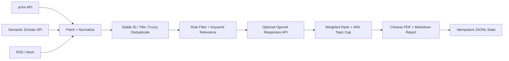

# cv-research-radar

`cv-research-radar` 是一个轻量级 Python 3.12 项目，每天自动收集、筛选、分析并汇总计算机视觉领域的新论文与研究博客，并生成适合阅读的中文 PDF 日报。第一版支持 arXiv、Semantic Scholar 元数据补充，以及标准 RSS/Atom Feed；不做网页爬虫、浏览器自动化或完整论文 PDF 分析。

## 工作流程与架构



核心原则：任何单个来源或单个补充请求失败，都只记录警告并继续其他来源、关键词回退、日报生成与状态保存。

## 安装

```bash
git clone <your-repository-url>
cd cv-research-radar
python -m venv .venv
# Windows: .venv\Scripts\activate
# macOS/Linux: source .venv/bin/activate
python -m pip install -e ".[dev]"
```

密钥只通过环境变量提供。可复制 `.env.example` 了解变量名，但程序不会自动要求 `.env` 存在：

```bash
export OPENAI_API_KEY="..."                 # 可选
export OPENAI_MODEL="your-structured-model" # 配置 Key 时同时设置
export SEMANTIC_SCHOLAR_API_KEY="..."       # 可选
```

PowerShell 对应写法为 `$env:OPENAI_API_KEY="..."`。不要把真实值写入 `.env.example`、YAML 或源码。

## 本地运行

```bash
python -m cv_radar validate-config
python -m cv_radar list-sources
python -m cv_radar run
python -m cv_radar run --date 2026-07-10
python -m cv_radar backfill --days 7
```

无 `OPENAI_API_KEY` 时程序完全可运行，使用确定性的关键词和元数据评分，并在日报中标注“未执行 LLM 分析”。无 Semantic Scholar Key 时仍尝试匿名 API，遇到速率限制则保留 arXiv 原始记录。

### 使用 ChatGPT Pro/Codex 订阅审阅（不调用 OpenAI API）

如果只有 ChatGPT Pro/Codex 订阅、不希望产生 API token 账单，使用两阶段文件交换流程：

```bash
# 1. 免费抓取、去重、规则筛选，并导出最多 daily_max_recommendations 个候选
python -m cv_radar prepare-review --date 2026-07-10

# 2. 让 ChatGPT/Codex 按 review/2026-07-10-prompt.md 分析候选，
#    并把严格 JSON 写到 review/2026-07-10-analysis.json

# 3. 严格校验分析、重新排名，并生成最终 Markdown/PDF
python -m cv_radar finalize-review --date 2026-07-10
```

第一步生成：

- `review/YYYY-MM-DD-candidates.json`：候选、稳定指纹、规则命中和关键词回退分析；
- `review/YYYY-MM-DD-prompt.md`：安全边界、分析要求和严格 JSON Schema；
- 预期的 `review/YYYY-MM-DD-analysis.json`：由 ChatGPT/Codex 订阅交互写入。

`prepare-review` 和 `finalize-review` 都不会调用 OpenAI API，即使当前环境意外设置了 `OPENAI_API_KEY`。`finalize-review` 要求每个候选指纹恰好出现一次；缺失、重复、额外候选、日期不一致或额外 JSON 字段都会拒绝生成报告。重复导入相同分析是幂等的。

仓库内的 `prompts/daily_codex_review.md` 是适合 Codex Scheduled Task 的固定执行说明。针对本地项目的定时任务必须在电脑开机且 ChatGPT/Codex 桌面应用保持运行时执行，并预先允许该项目访问 arXiv、Semantic Scholar 和配置的 RSS/Atom 域名。推荐使用 Local 模式，使私有 PDF 保留在主项目的 `reports/` 中。

CLI 在省略 `--date` 时读取 `RADAR_TIMEZONE`，默认使用 `America/New_York`；可在本地环境中覆盖为其他 IANA 时区。定时任务因此可以使用固定的 `python -m cv_radar prepare-review` 与 `python -m cv_radar finalize-review` 命令。

项目级 `.codex/rules/cv-radar.rules` 只允许 `prepare-review` 抓取入口在无人值守任务中访问网络，不会放行其他 Python、`cv_radar run` 或 Git 命令。首次添加或修改规则后重启一次 ChatGPT/Codex 桌面应用，使项目规则生效；项目需要处于受信任状态。

离线验收不会发起任何网络请求：

```bash
python -m cv_radar run --date 2026-07-10 --fixture-dir tests/fixtures
```

输出包括：

- `reports/YYYY-MM-DD.pdf` 与 `reports/latest.pdf`
- `reports/YYYY-MM-DD.md` 与 `reports/latest.md`
- `state/seen_items.jsonl` 与 `state/runs.jsonl`

每条推荐都会展示中文概览、亮点列表、新颖或值得注意之处、核心想法、局限性和与当前研究方向的联系。配置 OpenAI 后会基于标题和摘要生成更具体的中文分析；无 Key 时仍会提供保守的中文规则总结，并明确标注回退模式。

相同日期和相同输入重复执行时，日报覆盖为相同内容，状态按稳定键 upsert，不增加重复项目或运行记录。

`reports/` 与 `review/` 默认加入 `.gitignore`。日报、候选材料和订阅生成的分析只保存在运行环境本地，不会被提交或发布到 GitHub。

## 配置示例

`config/interests.yaml`：

```yaml
high_priority:
  - cell tracking
  - microscopy
medium_priority:
  - vision foundation models
exploration:
  - world models
exclude_keywords:
  - withdrawn
followed_authors: []
followed_venues: [CVPR, ICCV, ECCV, MICCAI]
daily_max_recommendations: 15
```

`config/sources.yaml` 中可扩展 arXiv 分类、查询词与 Feed：

```yaml
arxiv:
  enabled: true
  categories: [cs.CV, eess.IV]
  search_keywords: [microscopy]
  max_results: 100
semantic_scholar:
  enabled: true
feeds:
  - name: Example Vision Lab
    url: https://example.org/feed.xml
    item_type: blog
    enabled: true
```

`config/ranking.yaml` 默认权重严格合计为 1：relevance 35%、novelty 25%、evidence 15%、reproducibility 15%、trend 5%、exploration 5%。`minimum_rule_score` 控制进入 LLM 的最低规则分，`fuzzy_title_threshold` 控制模糊去重，`topic_daily_cap` 默认 0.4。

## 如何添加新信息源

1. 在 `src/cv_radar/sources/` 新增适配器，将响应标准化为 `ResearchItem`。
2. 复用 `ResilientHttpClient`，不要创建无超时、无重试或无限重试的请求。
3. 在来源或单条记录边界捕获错误，让其他来源继续。
4. 在 `tests/fixtures/` 添加最小响应样本，并用 mock 覆盖成功、失败和降级行为。
5. 如需配置字段，同步更新 `src/cv_radar/config.py`、默认 YAML 和配置测试。

未来的 embedding 去重接口已在 `EmbeddingDuplicateDetector` 中保留，第一版不会调用任何 embedding API。

## 调整兴趣和权重

- 把最直接相关的短语放入 `high_priority`，方法类主题放入 `medium_priority`，跨领域线索放入 `exploration`。
- 短语匹配忽略大小写，但不会做语义扩展；可同时配置常见缩写与全称。
- 排除词优先于加分规则。
- 修改排名权重时必须保持总和为 1；运行 `python -m cv_radar validate-config` 立即检查。
- 日报会优先覆盖高相关、新颖但证据较弱、博客/工程文章和探索方向，并限制单主题最多占目标推荐槽位的 40%。当来源本身主题不足时，日报可能少于每日上限。

## GitHub Secrets 与 Actions

项目包含 `.github/workflows/daily-radar.yml`，每天 `00:00 UTC`（`Asia/Singapore` 08:00）运行，也支持手动 `workflow_dispatch`。工作流使用 Python 3.12，先测试再生成日报；报告保留在运行环境且不提交，只暂存和提交 `state/` 的实际变化，权限仅为 `contents: write`。

连接 GitHub 仓库后：

1. 在 **Settings → Secrets and variables → Actions → Secrets** 添加可选的 `OPENAI_API_KEY` 和 `SEMANTIC_SCHOLAR_API_KEY`。
2. 在 **Variables** 添加 `OPENAI_MODEL`；应选择支持 Structured Outputs 的模型。
3. 在 **Actions** 页面启用工作流，并先用 **Run workflow** 手动验证。
4. 确认仓库/分支允许 GitHub Actions 创建提交；密钥不会出现在命令参数或日志输出中。

## 测试

```bash
python -m pytest
python -m compileall -q src
```

测试全部使用 fixture 或 `httpx.MockTransport`，不会连接真实外部 API。

## 当前限制

- 未实现网页爬虫、浏览器自动化、GitHub 项目搜索、完整 PDF 分析或 embedding 去重。
- RSS/Atom 缺失发布时间时只能使用抓取时刻，可能影响指定日期筛选。
- 关键词匹配是字面规则，不等同于语义召回；LLM 分析也只看到标题、摘要和元数据。
- Semantic Scholar 匿名额度较低；补充失败时 citation、venue 或开放 PDF 字段可能为空。
- arXiv 日期按 API 的 UTC `submittedDate` 查询；跨时区边界可能与本地“当天”略有差异。
- 主题 40% 上限按目标推荐槽位执行；主题不足时宁可减少推荐数。

## 后续路线

1. 增加 GitHub/API 代码项目来源和数据集来源。
2. 引入可选 embedding 去重与主题聚类，但保留本地降级路径。
3. 增加摘要级引用核查、趋势时间窗和更细的会议/作者画像。
4. 在明确授权后增加 PDF 元数据与章节级提取，而非无边界抓取。
5. 增加历史看板、邮件/消息推送和人工反馈闭环。

## OpenAI API 实现依据

LLM 层使用 OpenAI Python SDK 的 Responses API Pydantic 解析接口；Structured Outputs 会约束模型输出匹配所提供的 JSON Schema。参见 [OpenAI Structured Outputs 官方指南](https://developers.openai.com/api/docs/guides/structured-outputs)。模型名只从 `OPENAI_MODEL` 读取，不在源码中设置分散默认值。
